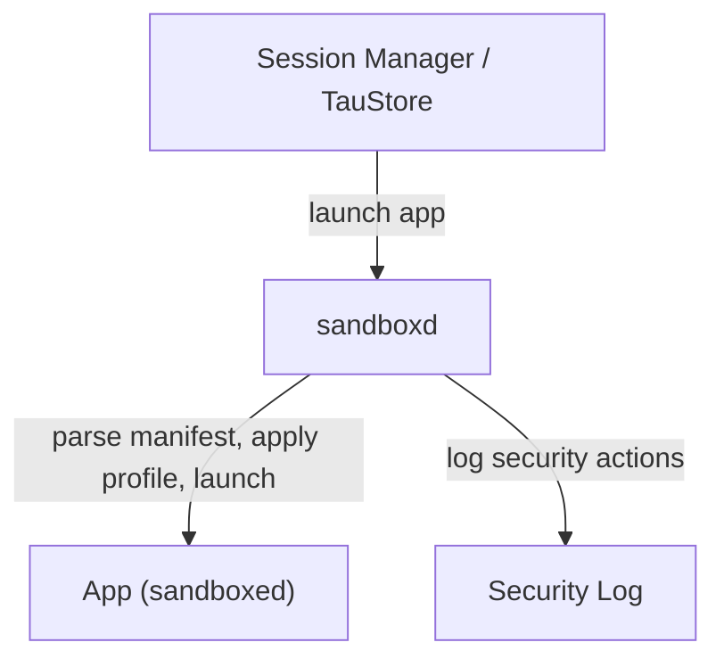

# Tau OS Security Model: Sandboxing & Permissions

Tau OS enforces strong security and privacy for all apps using a combination of manifest-driven permissions, AppArmor/SELinux, and secure filesystem isolation.

## Launch Flow Diagram


## 1. Manifest-Based Permissions
- Each app declares permissions in its manifest (e.g., `tau.toml` or `tau-app.json`):
  - Example:
    ```toml
    [permissions]
    network = true
    camera = false
    filesystem = "ro"
    ```
- Permissions map to allowed system calls, file paths, and device access.
- Granular controls: e.g., `network = true`, `camera = false`.

## 2. Runtime Sandbox Enforcement
- `sandboxd` parses the manifest and generates an AppArmor/SELinux profile dynamically.
- Namespaces (user, mount, net) are applied to isolate the app’s environment.
- All apps run as non-root by default.
- Security events and violations are logged for audit.
- If an app exceeds its permissions, it is terminated and a clear error is logged.
- (Prototype) Runtime permission prompts are possible for future support.

## 3. Integration Points
- All apps launched from the session manager, TauStore, or SDK CLI (`tau run`) are sandboxed.
- Audit logs are available for system admins and developers.

## 4. Troubleshooting Permission Denials
- If an app fails to start or is terminated:
  - Check the security log for violation messages.
  - Review the app’s manifest permissions.
  - Ensure the manifest matches the app’s actual needs.

## 5. Security Considerations
- Kernel-level security modules (AppArmor/SELinux) are used for enforcement.
- Isolation is designed to minimize performance impact.
- Future support for container runtimes (e.g., Podman) is planned.

---

**Tau OS: Secure by Design, Private by Default.** 